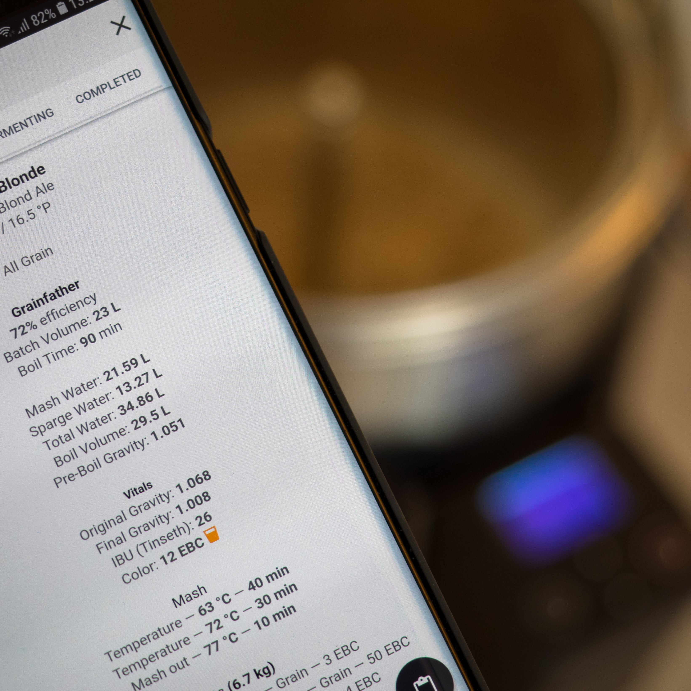

# What is Brewfather?

[Launch Brewfather APP](http://web.brewfather.app)  
[Go to Brewfather Main Page](http://brewfather.app)

Brewfather is made from the ground up to give you **the best** recipe design and brewing experience on both **desktop and mobile** devices. With a **modern design** that is easy to use. Get your recipes done in no time! With **automatic synchronisation** between your devices and **offline** support.

Brewfather includes

* **Powerful, intuitive** and **easy to use** interface
* **Multi device** support - one app everywhere - always!
* **Offline support**, auto saving and automatic synchronisation
* Fully-featured and easy to use **recipe** designer
* Complete **batch** tracking - log every step of your brew
* Brew timer with alarms and notifications for your brewday!
* **Profiles** for your equipment, mash schedule, fermentation steps, and water
* Highly **customizable** equipment profile to suit any brewing system
* Large customizable **ingredients** database
* **Inventory** stock tracking
* Multiple **style guidelines** \(BJCP, Brewers Association, Norbrygg, SHBF\)
* Remote logging from [**Tilt**](integrations/tilt-hydrometer.md), [**iSpindel**](integrations/ispindel/)**,** [**Brewpiless**](integrations/brewpiless.md)**,** [**MyBrewbot**](integrations/mybrewbot.md#what-is-mybrewbot) **and** [**Custom Stream**](integrations/custom-stream.md)\*\*\*\*
* **Print** your recipe or batch to PDF
* Import and export **BeerXML**
* Metric and US/Imperial units
* **Scale** recipes up/down
* Easily **share** recipes
* Estimate your Final Gravity based on many variables
* **Calculate** every important detail of your recipes and batches
* Easy to use yeast amount and yeast starter calculator
* Integrated **water adjustment calculator**
* Strike temperature calculation
* Fermentability as a trait for grains
* Proper calculation of hopstand bitterness
* And **many more** tools and features to help your brewing!

## Why Brewfather? 

Brewfather believes designing your recipes and tracking your batches should be easy and fun with easy access from all your devices with no hassle.


Brewfather strives to cover all your brewing needs in one place, new features are added continuously, [get in touch](https://bitbucket.org/brewfather/brewfather) if you miss any features or find any issues!


## Home-Screen App Support 

Brewfather can be added to your homescreen on Android and iOS devices to give you the best user experience.

## Free to try as long as you want! 

Brewfather can be **used for free as long as you want** with a few limitations. New users are granted a free 24-day membership of Brewfather Premium with no limitations.

Any of the tools and calculators can be used for free with no limitations as long as you want.

As a Free user your are limited to a maximum number of 10 recipes/batches, and no import or export. If you exceed these limitations you are free to delete any of your recipes or batches, or sign up for Brewfather Premium.

## Brewfather Premium 

You can sign up for a Premium subscription to unlock unlimited number of recipes/batches and premium features. The Premium subscription costs $1.99 per month or $19.99 annually, and will cover Brewfather's running costs and development of new features.

**Premium features include:**

* Unlimited number of recipes
* Unlimited number of batches
* Import and export features
* **Edit** readings from devices \(Tilt, iSpindel, BrewPiLess and more\)
* More upcoming premium features!


To sign up for **Brewfather Premium** - go to your account page in [Brewfather APP](https://web.brewfather.app/) and click **Upgrade to Premium!**


All payments and credit card details are handled securely by [Stripe](https://www.stripe.com/).

## Author / Owner 

Brewfather is owned by the company [**Warpkode AS**](https://warpkode.com), and made by ****Thomas Gangsøy, professional developer, and brewer at heart!

[**Warpkode AS**](https://warpkode.com) is owned and established by Thomas Gangsøy.

Brewfather® is a registered trademark.

## Documentation


The documentation for Brewfather is currently not complete. It is currently in the process of being written.


