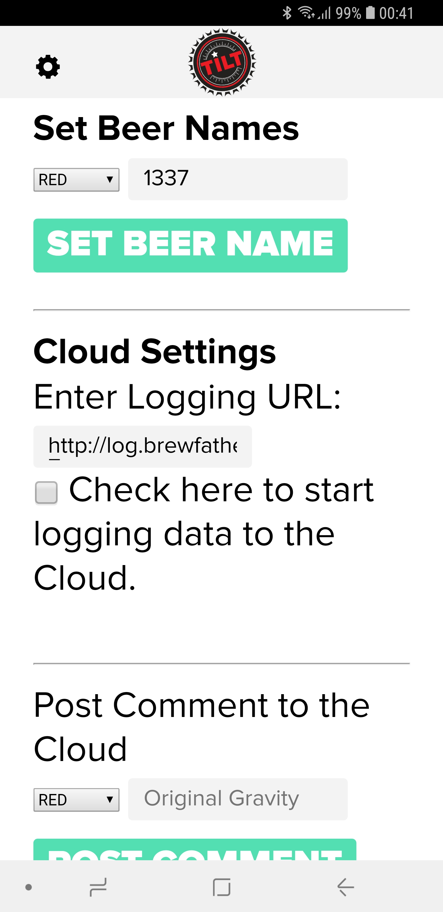

# Tilt Hydrometer

Drop your Tilt in the fermenter or a glass of water, go into the settings page in [Brewfather APP](https://web.brewfather.app), enable Tilt. 

You will then get a cloud URL that you need to copy into the **Cloud URL** in your Tilt-app or TiltPi settings. 

Write a comment and click enter/send to log immediately.

More details below. There is also a [video guide in Norwegian](https://youtu.be/DKC_pZ6kPIc) for TiltPi+Tilt Hydrometer.

Then go into the Fermentation tab of your batch and click **Devices.**  
After your Tilt has done it's first logging to Brewfather it will appear in the device list.

Click the **ATTACH** button to make it log to this batch. Wait 15-30 minutes for your Tilt to log the next time.

**Never log more than once every 15 minutes**, request logged more often than that will be ignored. This is the default value of the Tilt.

### Tilt 2 Phone App Setup

1. Enable "use custom cloud url" in the Settings
2. Copy cloud url from settings in Brewfather
3. Click Save


If you want continous logging to Brewfather when using the Tilt App you need to keep your device active and next to the fermenter at all times, the Tilt does not log to the cloud on its own. If the devices goes to sleep it will stop logging. Setting up a TiltPi is recommended.


### Tilt Phone App Setup

### TiltPi Setup

The best and most stable way to log is to have a dedicated Raspberry next to the fermenter, here is [how to set up a TiltPi](https://tilthydrometer.com/products/tilt-pi-raspberry-pi-disk-image-download). We recommend a Raspberry Pi Zero W + MicroSD 8GB + Micro USB charger.

1. Access the TiltPi via the browser 
2. Select TILT **color**
3. Paste your **Cloud URL**
4. Time interval **15 minutes** or more
5. **Enable** start logging to the cloud
6. Make sure "Use Default Cloud URL for All" is **OFF**.
7. Attach in batch in Brewfather

Enter a comment and click enter, to make the TiltPi send a logging request right away.

If you have issues with getting the TiltPi to log, try restarting it by removing the power and putting it back in, then start from 1.

### Attach to Batch

After the Tilt has done its first logging to Brewfather, it will appear in the device list located in your Batch &gt; Fermentation &gt; Readings &gt; **Devices**. Click on the Devices button and attatch your Tilt to the batch. The next time your Tilt logs, it will show up in your batch!

## Result

## Where can i get a Tilt Hydrometer?

_Want your shop listed here? Get in_ [_touch_](../more/contact.md)_._

### International

Buy directly from Tilt: [https://tilthydrometer.com/](https://tilthydrometer.com/)

### Norwegian dealers

Buy from [Brewshop.no](https://brewshop.no/produkt/utstyr/gjaering/utstyr-til-gjaering/tilt-hydrometer-termometer-ny-versjon)

Buy from [Petit-agentur.no](https://petit-agentur.no/search_result?keywords=tilt+hydrometer)

Buy from [Vestbrygg.no](https://www.vestbrygg.no/home/SearchForm?q=tilt+hydrometer)

Buy from [Strømmen Hjemmebrygg](https://homebrew.no/)

